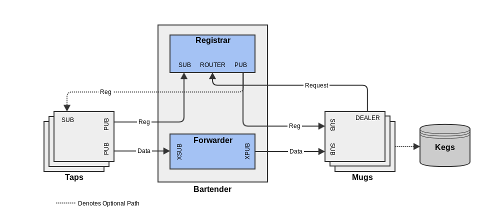

Lager Design Document
---------------------

Introduction
============

LAGER (Light-weight Accumulator Gathering Efficiently in Real-time) is a reliable logging system designed to allow multiple logging sources to log to multiple end users.  This design document outlines the architecture of the system as a whole as well as its individual components and trace-ability to the requirements.
        
System-Wide Design Decisions
============================

### Overall Operation

Lager defines three major components, Taps (sources of data), Mugs (consumers of data), and a Bartender (a middleware between Taps and Mugs).  These three components communicate in order to flow data from Taps to Mugs in a known format.

### Registration

Taps register with the Bartender as available data sources and provide their data format to the Bartender.  Mugs retrieve a list of available Taps and their data format from the Bartender and subscribe to their data.

### Data Flow
Once a Tap is registered with the Bartender it may begin flowing data.  Taps publish data through the Bartender via a proxy.  This proxy guarantees that Taps only publish data to one place.  Any Mugs subscribed to the data receive that data via the Bartender's proxy.

### Data Types
Supported data types for payload data (including fixed-length arrays of these types)

|Lager Type|C++ Type|Description|
|----------|--------|-----------|
|bool    |bool        |Boolean (True or False) stored as a byte|
|int8    |int8_t      |Byte (-128 to 127)|
|int16   |int16_t     |Integer (-32768 to 32767)|
|int32   |int32_t     |Integer (-2147483648 to 2147483647)|
|int64   |int64_t     |Integer (-9223372036854775808 to 9223372036854775807)|
|uint8   |uint8_t     |Unsigned integer (0 to 255)|
|uint16  |uint16_t    |Unsigned integer (0 to 65535)|
|uint32  |uint32_t    |Unsigned integer (0 to 4294967295)|
|uint64  |uint64_t    |Unsigned integer (0 to 18446744073709551615)|
|float32 |float       |Single precision float: sign bit, 8 bits exponent, 23 bits mantissa|
|float64 |double      |Double precision float: sign bit, 11 bits exponent, 52 bits mantissa|
|string  |std::string |utf8 encoded fixed length (maximum set by data format)|

Architecture
------------

High level data flow diagram



### General Operation

Lager defines two data flows:  a registration and data flow.  The registration involves a slightly modified version of ZMQ's CHP (Clustered Hashmap Protocol).  Taps publish their Data Format to the Bartender's Registrar, which updates a hashmap of available Data Formats.  Taps also optionally subscribe to the Registrar's available data to provide assurance (if desired) to avoid duplicate Tap registration.  Mugs request the available Taps and their Data Format using CHP and then subscribe to the desired data from the Bartender's Forwarder.  Mugs also constantly listen for updates to the hashmap from the Bartender's Registrar.  Mugs may also optionally store data into Kegs (non-volatile storage).

Detailed Design
---------------

### ZeroMQ Usage
In general, data flow is achieved using ZeroMQ (ZMQ).  Components use ZMQ sockets connected to each other via TCP or zmq_inproc, a local in-process (inter-thread) communication transport.  These sockets are initialized using ZMQ patterns specified in each component's design.  The patterns used by Lager are PUB/SUB, DEALER/ROUTER (a subset of REQ/REP), and CHP.  These patterns define the behavior of the communication between Lager components.

### Taps
Taps are the sources of data in the Lager system.  They are implemented as class objects which support a configuration phase and an execution phase.  Taps implement both the publisher and subscriber connections of the ZMQ CHP specification, however the subscriber connection is optional for use in avoiding duplicate Taps.  Taps also implement a separate publisher connection in order to publish data to the Forwarder.

#### Registration
Taps register by publishing a CHP message to the Bartender's Registrar during the configuration phase with the following structure:
```
frame 0: key, as a ZMQ string
frame 1: sequence number, 8 bytes in network order
frame 2: uuid, 16 bytes
frame 3: properties, as a ZMQ string
frame 4: value, as a ZMQ string
```
* `Frame 0`:  The key is a ZMQ string which identifies the Tap as a namespaced human readable identifier in the format:  /Namespace/Tap/.  E.g. /RobotA/MotionController/.  Note the leading and trailing slashes.
* `Frame 1`:  The sequence number is ignored in this part of the CHP spec and may be set to zero.
* `Frame 2`:  The uuid is a 16 byte unique identifier for the Tap and must be universally unique across the Lager system. It's generated using the libuuid library.
* `Frame 3`:  The properties frame of the CHP specification is not used in Lager, this should be an empty ZMQ string.
* `Frame 4`:  The value frame is a ZMQ string containing a versioned YAML-based Data Format (defined below).

#### Subscription
Taps may optionally subscribe to the registration flow. This enables the Tap to see updates to the hashmap and use them to: a) disallow duplicate registrations of itself, or b) determine the status of the Bartender. A callback function will provide both of these functionalities. This subscription is optional because some users may not want the overhead of an extra subscription on their Taps.

#### Data Flow
Once a Tap registers with the Bartender, it enters the execution phase and begins publishing data on its publisher connection.  Data Flow and Data Formats are further described below. The Tap invokes the Log Function, which results in the data being transmitted to the Bartender's forwarder proxy. If the Tap optionally subscribed to the registration flow, the Log Function will return the success of the transmission based on knowledge of the Bartender's status.

### Mugs

Mugs are the data sinks in the Lager system.  They are implemented as class objects which implement the snapshot and subscriber portions of the CHP specification in order to obtain the available Taps and their Data Format.  Mugs also implement a separate subscriber in order to receive data from the Forwarder.

#### Synchronization
Mugs synchronize their list of available data with the Bartender's Registrar initially by sending a CHP message to the Bartender's Registrar with the following structure:
```
frame 0:  "ICANHAZ?", as a ZMQ string
frame 1:  subtree specification, as a ZMQ string
```
* `Frame 0`:  The "ICANHAZ?" string is the literal ZMQ string and represents a request to the Registrar for available Taps and Data Formats
* `Frame 1`:  The subtree specification is a ZMQ string which may be empty or contain some portion of the desired CHP subtree defined by the Tap (the key in the Tap's registration message above).

The server must respond with zero or more CHP Tap descriptions, followed by a KTHXBAI message.  The Tap description message(s) will be received on the Mug's subscriber port, with the format:
```
frame 0:  key, as a ZMQ string
frame 1:  sequence number, 8 bytes in network order
frame 2:  uuid, 16 bytes
frame 3:  <empty>
frame 4:  value, as a ZMQ string
```
This format corresponds to the Tap's registration message above, with the exception being the empty frame 3 which may be set to zero.  After all Tap descriptions are received, a KTHXBAI message will be received, in the format:
```
frame 0:  "KTHXBAI", as a ZMQ string
frame 1:  sequence number, 8 bytes in network order
frame 2:  <empty>
frame 3:  <empty>
frame 4:  <empty>
```
This message indicates to the Mug that all Tap descriptions have been sent.  The Mug should then begin listening for data from the Forwarder.

#### Update Messages
Once the initial synchronization has occurred, any subsequent updates to the list of CHP Tap registrations will be sent to the Mug.  In the absence of updates, the Bartender's Registrar should send a HUGZ message at in interval of 1Hz, in the following format:
```
frame 0:  "HUGZ", as a ZMQ string
frame 1:  00000000, 8 bytes in network order
frame 2:  <empty>
frame 3:  <empty>
frame 4:  <empty>
```
* `Frame 0` is the literal ZMQ string "HUGZ" and the remaining frames may be ignored.  The Mug may treat the absence of a HUGZ message as an indicator of a connection problem or crash between the Mug and the Bartender.

### Bartender

The Bartender has three tasks to perform in the Lager system: to register Taps, provide Tap Data Formats to Mugs, and forward Tap Data Frames to Mugs.  The Registrar and Forwarder perform these three tasks.

#### Registrar

The Registrar accepts CHP registration messages from Taps (described above) and maintains the CHP specification's hashmap.  It acts as the server portion of the CHP specification and implements the snapshot, publisher, and collector connections.  It accepts registration messages from Taps via the collector connection, accepts Data Format requests from Mugs via the snapshot connection, and provides Data Format messages via the publisher connection.

#### Forwarder

The Forwarder accepts Data Frames from Taps on a proxy subscriber connection and transmits Data Frames to Mugs on a proxy publisher connection.  This proxy ensures the many to many relationship possible with Lager while avoiding duplicate transmission of data in the one Tap to many Mugs case.

### Kegs

Kegs are data stores located in non-volatile memory. All subscribed taps which are fed into a single keg are stored in the same log file (*.lgr). They have a file layout specified as follows.
```
frame 0:  version, 2 bytes in network order, keg format version as a 16 bit unsigned integer
frame 1:  dataFormatOffset, 8 bytes in network order, offset of format location as a 64 bit unsigned integer
frame 2:  binary data of the format specified by the Data Format (offset + size, in network order)
frame 3:  UTF8 encoded string containing the XML of the data formats (schema below)
```
Binary data
```
frame 0:  uuid, 16 bytes in network order
frame 1:  timestamp, epoch nanoseconds, 8 bytes unsigned
frame 2:  payload, the items in the order specified by the format (offset and length)
```
Keg Data Format schema:
```xml
<?xml version="1.0" encoding="UTF-8"?>
<xs:schema xmlns:xs="http://www.w3.org/2001/XMLSchema">

<!-- custom types -->
<xs:simpleType name="LimitedString">
    <xs:restriction base="xs:string">
        <xs:maxLength value="8"/>
    </xs:restriction>
</xs:simpleType>

<xs:simpleType name="PositiveInteger">
    <xs:restriction base="xs:integer">
        <xs:minInclusive value="0"/>
    </xs:restriction>
</xs:simpleType>

<!-- attributes -->
<xs:attribute name="name" type="xs:string"/>
<xs:attribute name="type" type="xs:string"/>
<xs:attribute name="size" type="PositiveInteger"/>
<xs:attribute name="offset" type="PositiveInteger"/>
<xs:attribute name="version" type="LimitedString"/>
<xs:attribute name="uuid" type="xs:string"/>
<xs:attribute name="key" type="xs:string"/>
<xs:attribute name="value" type="xs:string"/>

<!-- elements -->
<xs:element name="item">
    <xs:complexType>
        <xs:attribute ref="name" use="required"/>
        <xs:attribute ref="type" use="required"/>
        <xs:attribute ref="size" use="required"/>
        <xs:attribute ref="offset" use="required"/>
    </xs:complexType>
</xs:element>

<xs:element name="format">
    <xs:complexType>
        <xs:sequence>
            <xs:element ref="item" minOccurs="1" maxOccurs="unbounded"/>
        </xs:sequence>
        <xs:attribute ref="version" use="required"/>
        <xs:attribute ref="uuid" use="required"/>
    </xs:complexType>
</xs:element>

<xs:element name="formats">
    <xs:complexType>
        <xs:sequence>
            <xs:element ref="format" minOccurs="1" maxOccurs="unbounded"/>
        </xs:sequence>
    </xs:complexType>
</xs:element>

<xs:element name="meta">
    <xs:complexType>
        <xs:attribute ref="key" use="required"/>
        <xs:attribute ref="value" use="required"/>
    </xs:complexType>
</xs:element>

<xs:element name="metadata">
    <xs:complexType>
        <xs:sequence>
            <xs:element ref="meta" minOccurs="1" maxOccurs="unbounded"/>
        </xs:sequence>
    </xs:complexType>
</xs:element>

<!-- main -->
<xs:element name="keg">
    <xs:complexType>
        <xs:sequence>
            <xs:element ref="formats" minOccurs="1" maxOccurs="1"/>
            <xs:element ref="metadata" minOccurs="0" maxOccurs="1"/>
        </xs:sequence>
    </xs:complexType>
</xs:element>

</xs:schema>
```
Sample Keg Format XML
```xml
<?xml version="1.0" encoding="UTF-8" standalone="no" ?>
<keg>
    <formats>
        <format uuid="72657b2f-4c2d-4cde-a37f-a961a45ee559" version="BEERR01">
            <item name="uint1" offset="0" size="4" type="uint32_t"/>
            <item name="int1" offset="4" size="4" type="int32_t"/>
            <item name="double1" offset="8" size="8" type="float64"/>
            <item name="ushort1" offset="16" size="2" type="uint16_t"/>
            <item name="short1" offset="18" size="2" type="int16_t"/>
            <item name="ubyte1" offset="20" size="1" type="uint8_t"/>
            <item name="byte1" offset="21" size="1" type="int8_t"/>
            <item name="float1" offset="22" size="4" type="float32"/>
        </format>
    </formats>
    <metadata>
        <meta key="notes" value="Ran a test with some parameters"/>
    </metadata>
</keg>
```

### Data Formats

#### Registration Message
The format for the Tap registration CHP message's value field is an XML schema of the following format, where BEERR01 must be a literal string value corresponding to this version of the XML schema.  Subsequent versions of this schema may increment the number portion of the version.  This schema also defines the format of the value frame in the Tap description messages defined above.
```xml
<?xml version="1.0" encoding="UTF-8"?>
<xs:schema xmlns:xs="http://www.w3.org/2001/XMLSchema">

<!-- custom types -->
<xs:simpleType name="LimitedString">
    <xs:restriction base="xs:string">
        <xs:maxLength value="8"/>
    </xs:restriction>
</xs:simpleType>

<xs:simpleType name="PositiveInteger">
    <xs:restriction base="xs:integer">
        <xs:minInclusive value="0"/>
    </xs:restriction>
</xs:simpleType>

<!-- attributes -->
<xs:attribute name="name" type="xs:string"/>
<xs:attribute name="type" type="xs:string"/>
<xs:attribute name="size" type="PositiveInteger"/>
<xs:attribute name="offset" type="PositiveInteger"/>
<xs:attribute name="version" type="LimitedString"/>

<!-- item -->
<xs:element name="item">
    <xs:complexType>
        <xs:attribute ref="name" use="required"/>
        <xs:attribute ref="type" use="required"/>
        <xs:attribute ref="size" use="required"/>
        <xs:attribute ref="offset" use="required"/>
    </xs:complexType>
</xs:element>

<!-- main -->
<xs:element name="format">
    <xs:complexType>
        <xs:sequence>
            <xs:element ref="item" minOccurs="1" maxOccurs="unbounded"/>
        </xs:sequence>
        <xs:attribute ref="version" use="required"/>
    </xs:complexType>
</xs:element>

</xs:schema>
```

#### Data Message

The data messages published by the Taps and subsequently forwarded on to the Mugs via the Forwarder contain the following format:
```
frame 0:  uuid, 16 bytes
frame 1:  version, 2 bytes, major/minor
frame 2:  flags, 2 bytes
frame 3:  timestamp, epoch nanoseconds, 8 bytes unsigned
frame 4:  payload, (length defined by Data Format)
```
* The `uuid` is the corresponding Tap uuid used in its registration message.
* The `version` is a 2 byte major/minor version of the message format
* The `flags` is a 2 byte register to give various TBD flags (compression, etc).
* The `payload` consists of a single row of data for the given timestamp and must match the data format provided by the Tap.

Notes
-----

### Glossary

• Hashmap - an abstract map based collection class that is used for storing Key & value pairs
• ZMQ PUB/SUB (Publisher/Subscriber pattern) - https://rfc.zeromq.org/spec:29/PUBSUB
• ZMQ REQ/REP (Request/Reply pattern, specifically using DEALER/ROUTER) - https://rfc.zeromq.org/spec:28/REQREP
• ZMQ CHP (Clustered Hashmap Protocol) - https://rfc.zeromq.org/spec:12/CHP
• Tap - a source of data to be logged
• Mug - is a recipient of data from a Tap
• Bartender - is a middleware responsible for the connection between Taps and Mugs
• Log Action - one user invocation of the logging system
• Frame - one atomic set of data for a given log action
• Data Format - a description of the organization of data
• Keg - a non-volatile memory location for storage of files
• libuuid - a library used to generate unique identifiers - https://linux.die.net/man/3/libuuid

### Abbreviations and Acronyms

• ZMQ - ZeroMQ - A distributed messaging library 
• YAML - YAML Ain't Markup Language - A human readable serialization language

